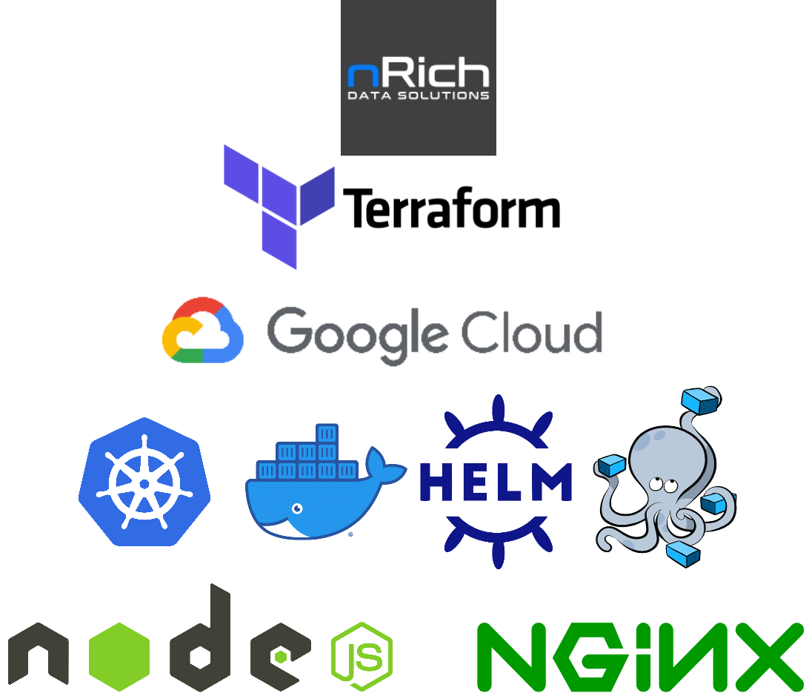

# nRich

# Introduction
**nRich data solutions** was founded by experienced visionaries and business leaders, dedicated to innovation, excellent customer service and a track record of success. 

This project is the homework i was assigned by the company to prove my knowledge in basic devops tools that are widely used in production areas.

## Table of contents
* [General info](#general-info)
* [Technologies](#technologies)
* [Setup](#setup)

## General info
**Will Update Soon** 

## Technologies
This Project was created with:
* [Docker](https://www.docker.com/) - version: 20.10.22, build 3a2c30b
* [Docker-Compose](https://docs.docker.com/compose/) - version: v2.15.1
* [GCP](https://cloud.google.com/) Based the project using GCP Resources
* [Kubernetes](https://kubernetes.io/) Client Version: v1.26.1
* [Helm](https://helm.sh/) - version: v3.9.2+g1addefb
* [NGINX](https://hub.docker.com/_/nginx) - Used the docker nginx image (13-02-2023)
* [NodeJS](https://hub.docker.com/_/node) - Used the docker nodejs image (13-02-2023)
* **Web App supplied by nrich**
## Setup

**Will Update Soon** 
## License

[BSD3](https://github.com/teamdigitale/licenses/blob/master/BSD-3-Clause)
